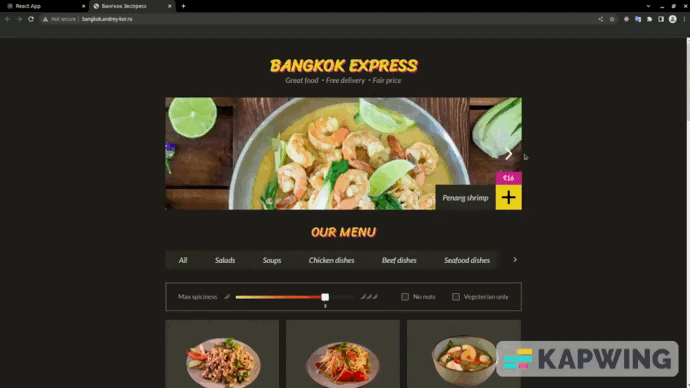

# BANGKOK EXPRESS
## Базовое описание
Приложение <a href="http://bangkok.andrey-kor.ru/">интернет-магазина</a>

## Возможности:
- Фильтрация товаров:
    - слайдером;
    - по флагам свойств;
    - по категориям;
- Добавление товаров в корзину;
- Возможность сделать заказ (данные формы передаются на тестовый сервер).

## Особенности:
- Написано на чистом JS;
- При написании приложения реализован компонентный подход;
- Собрано c Webpack (конфигурация вручную);
- Использован Babel компилятор.

## Используемые инструменты:
- JavaScript;
- Webpack;
- Babel;

---

## Автор 
Код JavaScript: [Андрей Корнеев](https://github.com/andrey-kor)  
Верска [Learn JavaScript](https://learn.javascript.ru/)
