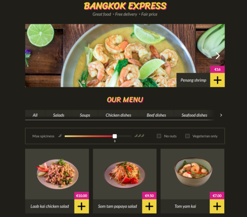

# BANGKOK EXPRESS
## Базовое описание
Приложение интернет-магазина

## Возможности:
- Фильтрация товаров:
    - слайдером по остроте;
    - по флагам свойств;
- Отображение товаров по категориям;
- Добавление товаров в корзину;
- Возможность сделать заказ (данные формы передаются на тестовый сервер).

## Особенности:
- Написано на чистом JS;
- Собрано c [Webpack](https://webpack.js.org/) (конфигурация вручную);
- Использован [Babel](https://babeljs.io/) компилятор.

## Используемые инструменты:
- JavaScript;
- Webpack;
- Babel;

## Автор 
Код JavaScript: [Андрей Корнеев](https://github.com/andrey-kor)  
Верска [Learn JavaScript](https://learn.javascript.ru/)

---
Приложение учебного курса по JavaScript.